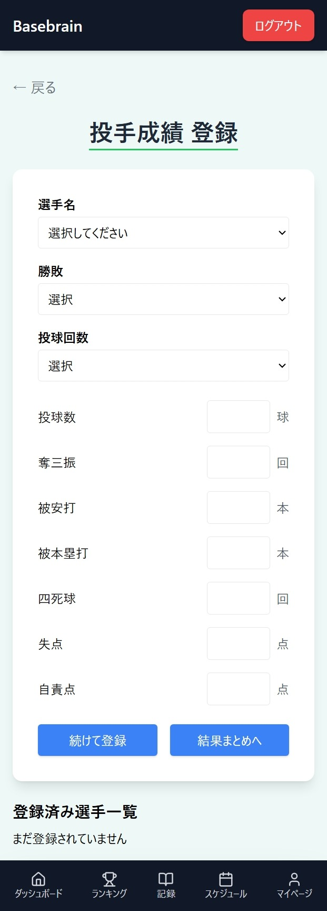

# Basebrain（野球チームマネジメントシステム）

# 📘 概要
野球チームの監督・コーチ・マネージャー向けに、選手管理・試合管理・成績分析・スケジュール管理などを行えるチームマネジメントアプリ。 
選手は自分の成績やチーム内ランキングをスマホで簡単に確認でき、練習や試合の意欲につなげられます。

---

# 開発背景
野球を10年間続けてきましたが、当時はチーム内での成績を確認する手段が紙のスコアブックのみで、自分で計算する必要がありました。 
スマホで自分の成績やチーム内ランキングを簡単に見られる環境があれば、モチベーションの向上にも繋がったであろうと考えました。 
本アプリは、そうした個人的な経験を元に作成したものであり、Laravelやフロントエンド技術の学習として開発しました。
また、より動的なUIやSPA（ページ遷移なしで動くUI）構成を学ぶ目的で React を導入しました。
実際に導入してみることで、API通信によるデータ取得、状態管理の仕組みなど（useState / useEffect等）に触れることができました。

---

# 技術スタック

**バックエンド** | PHP 8.4 / Laravel 12 
**フロントエンド** | react / Tailwind CSS 
**データベース** | MySQL 8 
**環境構築** | Docker 
**テスト** | PHPUnit 
**メール機能**  Mailpit 
**認証** | Laravel Breeze

---

# 主な機能

## 共通

### ユーザー管理・認証
- ユーザー登録・ログイン・ログアウト
- ロール別権限管理（首脳陣・選手・ゲスト）

### ランキングの表示
- 打者ランキング(打率・出塁率・安打・本塁打・打点・盗塁)
- 投手ランキング(防御率・勝利数・奪三振数)

### スケジュール
- 日付ごとのスケジュール確認

## roleがplayerの場合

### ダッシュボード
- 個人成績の確認(出場情報、打者成績、投手成績)

### マイページ
- ユーザー情報の更新(名前・メールアドレス)

## roleがcoachの場合

### ダッシュボード
- チーム成績の確認(チーム成績、打者成績、投手成績)

### 記録
- 試合・選手記録の登録／編集／削除
- 試合ごとの結果、野手成績・投手成績の確認

### スケジュール
- スケジュールの登録(日付・時間・内容・場所・メモ)

### マイページ
- ユーザー情報の更新(名前・メールアドレス・チーム名)
- 招待コードの確認(リンクコピーでURL生成し、URLからアクセスした場合、自動で招待コード入力に対応)

---

# 画面イメージ

## データ入力画面

<table>
<tr>
  <td valign="top">
    ダッシュボード(coach) 
     
  </td>
  <td valign="top">
    ダッシュボード(player) 
     
  </td>
</tr>

<tr>
  <td valign="top">
    打者ランキング 
    
  <td valign="top">
    投手ランキング 
    
  </td>
</tr>

<tr>
  <td valign="top">
    試合一覧 
    
  <td valign="top">
    試合詳細 
    
  </td>
</tr>

<tr>
  <td valign="top">
    試合登録ページ 
    
  <td valign="top">
    打撃成績登録ページ 
    
  </td>
  <td valign="top">
    登録成績登録ページ 
    
  </td>
  <td valign="top">
    登録結果ページ 
    
  </td>
</tr>

<tr>
  <td valign="top">
    スケジュール(coach)予定追加モーダル 
    
  <td valign="top">
    スケジュール(coach)予定確認画面 
    
  </td>
  <td valign="top">
    スケジュール(player)予定確認画面 
    
  </td>
</tr>

<tr>
  <td valign="top">
    マイページ(coach) 
    
  <td valign="top">
    マイページ(player) 
    
  </td>
</tr>

<tr>
  <td valign="top">
    紹介ページ(未ログイン) 
    
</tr>

</table>
